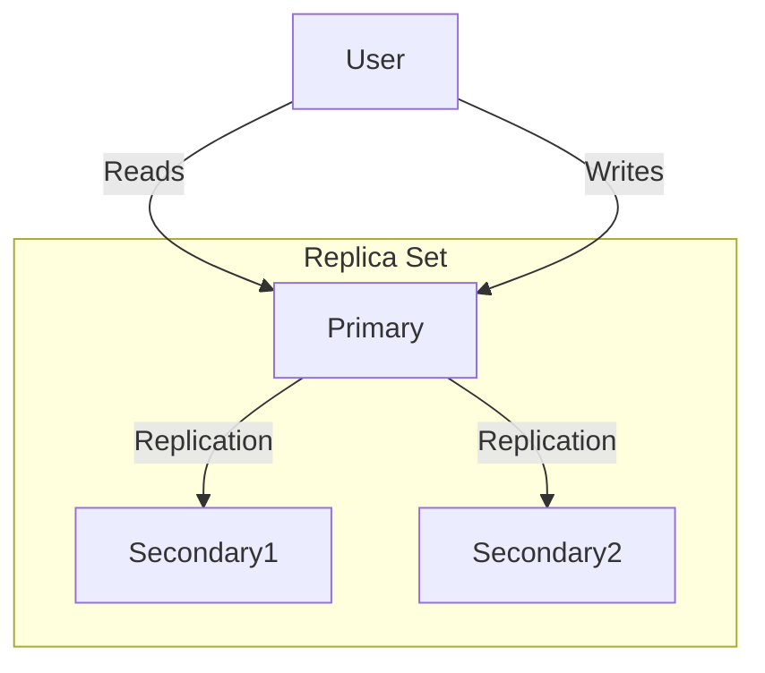

# Zajęcia 3 (Administrowanie bazą MongoDB)

<br>
Na tych zajęciach będziesz miał okazję wykonać kilka działań administratorskich (w tym utworzyć Replica Set) 
w specjalnie przygotowanym kontenerze dockerowy.

Zadania znajdziesz na [Wiki](https://github.com/jakubpradzynski/mongodb-spring-kurs-dla-poczatkujacych/wiki).

---

# Server MongoDB (`mongod`)

<br>

1. Czym jest?
2. [Opcje uruchomieniowe](https://www.mongodb.com/docs/manual/reference/program/mongod/).
3. [Plik konfiguracyjny](https://www.mongodb.com/docs/manual/reference/configuration-options/).

---

# Co będzie konfigurowane w `mongod`?

<br>

1. Port
2. Autoryzacja.
3. Ścieżki do danych generowanych przez proces.
4. Logi.
5. Profilowanie.

---
layout: two-cols
---

# Replica Set 

<br>

1. Czym jest?
2. Elekcja primary.
   - [RAFT](https://raft.github.io/)
   - [RAFT wizualizacja](http://thesecretlivesofdata.com/raft/)
3. Tworzenie / zarządzanie.

::right::

<br><br>



---

# Funkcja explain (query planning, indeksy)

<br>

1. [Query plans](https://www.mongodb.com/docs/manual/core/query-plans/).
2. Funkcja [explain](https://www.mongodb.com/docs/manual/reference/command/explain/).
   - weryfikacja wykorzystania indeksów

---

# Dashboard / metryki

<br>

1. Metryki z serwera
   - `mongostat` i `mongotop`
2. Dashboard biznesowy w chmurze

---

# Środowisko

<br>

Repozytorium: https://github.com/jakubpradzynski/mongodb-spring-kurs-dla-poczatkujacych

Skrypt: `mongodb_administration/run_mongo_host_in_docker.sh`.

<br>

Wiedza i zadania do wykonania są na [Wiki](https://github.com/jakubpradzynski/mongodb-spring-kurs-dla-poczatkujacych/wiki).

---
layout: center
---

# Zadania administracyjne

---
layout: center
---

### 1. Uruchom serwer MongoDB za pomocą komendy `mongod`

<br>

<details>
  <summary>Rozwiązanie</summary>

```shell
mkdir -p /data/db
mongod
```

</details>

<br>

---
layout: center
---

### 2. Uruchom serwer MongoDB na porcie `2022`

<br>

<details>
  <summary>Rozwiązanie</summary>

```shell
mongod --port 2022
```

</details>

<br>

---
layout: center
---

### 3. Uruchom serwer MongoDB z włączoną autoryzacją i utwórz użytkownika dla administratora

<br>

<details>
  <summary>Rozwiązanie</summary>

Uruchomienie serwera z włączoną autoryzacją:
```shell
mongod --auth
```

Utworzenia użytkownika przy pierwszym zalogowaniu:
```js
  db.createUser({
    user: "admin",
    pwd: "admin",
    roles: [
      {role: "root", db: "admin"}
    ]
  })
```

</details>

<br>

---
layout: center
---

### 4. Uruchom serwer MongoDB z podanymi ścieżkami dla danych bazy i logów

<br>

<details>
  <summary>Rozwiązanie</summary>

```shell
mkdir -p /my_database/db /my_database/log
mongod --dbpath /my_database/db --logpath /my_database/log/mongod.log --fork
```

</details>

<br>

---
layout: center
---

### 4.1. Zmień poziom logowania bazy

<br>

<details>
  <summary>Rozwiązanie</summary>

```js
db.getLogComponents()
db.test.insert({"collection": "test"})
db.adminCommand({ "getLog": "global" })
db.setLogLevel(1)
db.test2.insert({"collection": "test2"})
db.adminCommand({ "getLog": "global" })
```

</details>

<br>

---
layout: center
---

### 4.2. Zmień profilowanie bazy

<br>

<details>
  <summary>Rozwiązanie</summary>

```js
db.getProfilingStatus()
db.setProfilingLevel( 1, { slowms: 0 } )
db.test.insert({"collection": "test"})
db.system.profile.find().pretty()
```

</details>

<br>

---
layout: center
---

### 5. Przepisz uruchomienie MongoDB z linii komend do pliku

<div class="grid grid-cols-2 gap-4">
<div>

<br>

<details>
  <summary>Rozwiązanie</summary>

Utwórz plik yaml:
```shell
touch ~/mongodb.conf
```

Na koniec uruchom bazę za pomocą tej konfiguracji:
```shell
mongod --config ~/mongodb.conf
```

</details>

<br>

</div>
<div>

<br>

<details>
  <summary>Plik</summary>

Używając np. `vim` zapisz:
```yaml
storage:
  dbPath: "/data/db"
systemLog:
  path: "/data/log/mongod.log"
  destination: "file"
net:
  bindIp : "127.0.0.1"
  port: "2022"
operationProfiling:
  mode: "all"
  slowOpThresholdMs: 0
security:
  authorization: "enabled"
processManagement:
  fork: true
```

</details>

<br>

</div>
</div>

---
layout: center
---

### 6. Uruchom Replica Set składający się z 3 demonów MongoDB

<div class="grid grid-cols-2 gap-4">
<div>

<br>

<details>
  <summary>Rozwiązanie</summary>

Na jednym z hostów:
```js
rs.initiate()
rs.add("localhost:3000X")
rs.add("localhost:3000Y")
```

</details>

<br>

</div>
<div>

<br>

<details>
  <summary>Przykładowy plik konfiguracyjny</summary>

```yaml
storage:
  dbPath: "/data/db1"
systemLog:
  path: "/data/log1/mongod.log"
  destination: "file"
net:
  port: "30001"
replication:
  replSetName: "TNABwP"
processManagement:
  fork: true
```

</details>

<br>

</div>
</div>

---
layout: center
---

### 6.1. Zobacz, który proces w Replica Set jest `primary`

<br>

<details>
  <summary>Rozwiązanie</summary>

```js
db.isMaster().primary
```

</details>

<br>

---
layout: center
---

### 6.2. Nakaż procesowi `primary` ustąpić i zobacz, który zostanie wybrany jako nowy `primary`

<br>

<details>
  <summary>Rozwiązanie</summary>

```js
db.stepDown()
db.isMaster().primary
```

</details>

<br>

---
layout: center
---

### 7. Korzystanie z explain() - weryfikacja użycia indeksu

<br>

<details>
  <summary>Rozwiązanie</summary>

```js
db.users.insertOne({"name": "Jakub", "surname": "Prądzyński"})
db.users.createIndex({"name": 1, "surname": 1})
db.users.find({"surname": /P/}).explain() // Brak IXSCAN
db.users.createIndex({"surname": 1, "name": 1})
db.users.find({"surname": /P/}).explain() // IXSCAN drugiego indeksu
```

</details>

<br>

---
layout: center
---

### 8. Metryki techniczne - obserwacja

---
layout: center
---

### 9. Metryki biznesowe - dodaj dashboard w swojej bazie w [cloud.mongodb.com](https://cloud.mongodb.com)

<br>

<details>
  <summary>Rozwiązanie</summary>

<div align="center">
    
</div>

</details>

<br>

---
layout: fact
hideInToc: true
---

# Koniec zajęć 3